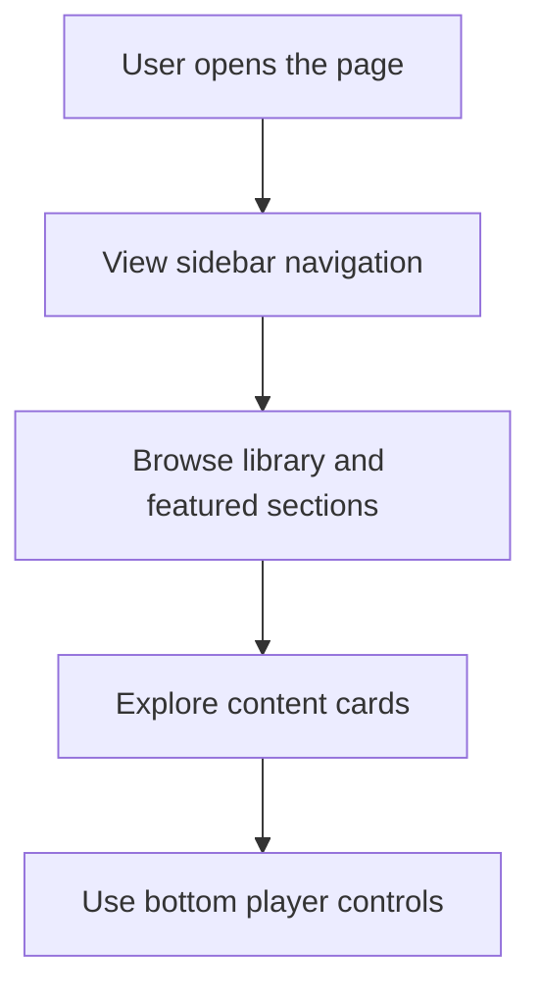

<p align="center">
  
</p>

<h1 align="center">Spotify-CSS</h1>

<p align="center">
  
  
  
  
  
  
</p>

<p align="center">A polished static front-end recreation of a Spotify-inspired web player built with HTML and CSS. The project focuses on visual design, layout structure, and a modern dark-theme experience for a music streaming interface.</p>

## Table of Contents

- [🚀 Project intro](#-project-intro)
- [📁 Project structure](#-project-structure)
- [⭐ Differentiators](#-differentiators)
- [🔧 Features](#-features)
- [🧰 Tech stack](#-tech-stack)
- [⚙️ Install methods](#️-install-methods)
- [🔐 Environment variables](#-environment-variables)
- [📜 Available scripts](#-available-scripts)
- [🚀 Deployment notes](#-deployment-notes)
- [🤝 Contributing](#-contributing)
- [📄 License](#-license)

## 🚀 Project intro

Spotify-CSS is a UI-focused portfolio project that recreates the feel of a streaming platform’s home screen. It includes a left sidebar, a library section, featured content cards, and a bottom player bar, all styled through custom CSS without relying on JavaScript or a backend.

## 📁 Project structure

```txt
Spotify-CSS/
├── assets/
│   ├── logo.png
│   ├── library_icon.png
│   ├── backward_icon.png
│   ├── forward_icon.png
│   ├── card1img.jpeg
│   ├── card2img.jpeg
│   ├── card3img.jpeg
│   ├── card4img.jpeg
│   ├── card5img.jpeg
│   ├── card6img.jpeg
│   ├── player_icon1.png
│   ├── player_icon2.png
│   ├── player_icon3.png
│   ├── player_icon4.png
│   ├── player_icon5.png
│   ├── controls_icon1.png
│   ├── controls_icon2.png
│   ├── controls_icon3.png
│   ├── controls_icon4.png
│   ├── controls_icon5.png
├── index.html
├── style.css
└── README.md
```

## ⭐ Differentiators

- Pure HTML and CSS implementation with no build tooling
- Clean, modern interface inspired by music streaming platforms
- Easy to preview locally without installing dependencies
- Responsive layout adjustments for narrower screens
- All visual assets stored locally for a self-contained experience

## 🔧 Features

### Core features

| Feature | Status | Notes |
| --- | --- | --- |
| Sidebar navigation | ✅ Current | Includes Home and Search sections for quick access |
| Library panel | ✅ Current | Displays playlist and podcast prompts in a dedicated area |
| Featured content sections | ✅ Current | Shows recently played, trending, and chart-based cards |
| Bottom music player | ✅ Current | Includes album information, playback controls, and volume interaction |
| Visual styling | ✅ Current | Uses a dark theme, rounded panels, and hover effects for polish |

### Flow diagram



## 🧰 Tech stack

- **Structure:** HTML5
- **Styling:** CSS3
- **Icons:** Font Awesome
- **Typography:** Google Fonts (Montserrat)
- **Assets:** Local image files and static media

## ⚙️ Install methods

### 📦 Open directly

1. Clone the repository.
2. Open the project folder.
3. Launch the app by opening the index.html file in your browser.

### 🖥️ Preview with a local server

If you prefer to serve the project locally, run:

```bash
python -m http.server 8000
```

Then open:

```txt
http://localhost:8000
```

## 🔐 Environment variables

No environment variables are required for this project. It is a static front-end layout and does not depend on external services or API credentials.

## 📜 Available scripts

No build or automation scripts are currently configured. The app runs directly as a static website.

## 🚀 Deployment notes

This project can be deployed as a static site on services such as GitHub Pages, Netlify, or Vercel. Because it has no backend or build step, deployment is straightforward.

## 🤝 Contributing

Contributions are welcome. You can help by improving the layout, refining the styling, or adding new UI sections to expand the experience.

## 📄 License

No license file is included in the repository. Please contact the repository owner for usage terms.
